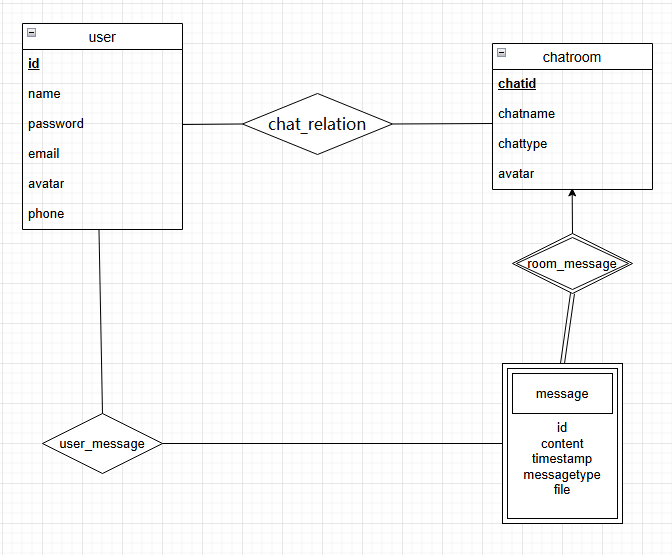
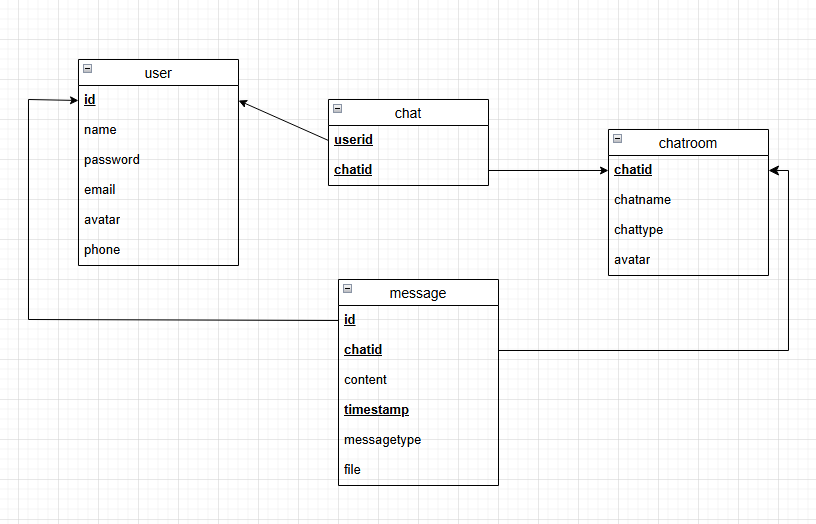

# 用户

**用户首先是需要用户名的（昵称），然后会给予其一个全局唯一ID，（后端算法自动生成）**

**其次，用户有一个密码，有电话号码，有邮箱地址，有头像**


# 信息

**信息内容比较繁杂，首先要知道信息是二进制传输的， 支持文件，图片（特殊文件），普通信息，emoji**

所以需要每个信息一个ID?显然不用，可以用弱实体集操作

每个信息内部含有：信息的类型？，信息内容，如果是图片或者文件该怎么存储在数据库里面，这个信息的时间戳


# 聊天

聊天分为私有聊天和多人聊天，私有聊天就是只有两个人的聊天，公有聊天就是有很多人的聊天（群聊），每个聊天应该有一个ID， 如果是聊天室，需要一个聊天名，不然就是好友的名字，聊天的的头像


# 最后

要求能够查询历史记录，用户能过知道自己聊天的是一个人还是群聊


# API

| API地址                            | 用途                         |
| ---------------------------------- | ---------------------------- |
| /app/ws/{chatroom}/{username}      | 用户要发送给对应聊天室的位置 |
| /topic/{chatroom}                  | 订阅到某一个聊天室           |
| /api/createchatroom/{userId}       | 用户创造一个聊天室           |
| /api/joinchatroom/{username}       | 用户加入一个聊天室           |
| /api/leavechatroom/{username}      | 用户退出一个聊天室           |
| /api/deletechatroom/{chatRoomName} | 用户删除一个聊天室           |
| /api/getchatroom/{chatRoomName}    | 获取某个聊天室               |
| /api/getchatlist/{userName}        | 获取用户所有聊天室           |
| /api/register                      | 注册                         |
| /api/login                         | 登录                         |
| /api/updateavatar/{username}       | 更新用户头像                 |
| /api/updatepassword/{username}     | 更新用户密码                 |
| /api/logout/{username}             | 登出                         |
| /api/getuser/{username}            | 获取某个用户所有信息         |
| /api/gethistory/{chatname}         | 获取聊天室所有记录           |
| /api/gethistory/{chatname}/{tag}   | 查询对应的记录               |
|                                    |                              |
|                                    |                              |
|                                    |                              |


# 信息交互数据结构体

| 传输信息的内容 | 作用                                             |
| -------------- | ------------------------------------------------ |
| sender         | 发送信息的用户名                                 |
| chatid         | 发送到的聊天室                                   |
| content'       | 内容                                             |
| timestamp      | 时间戳                                           |
| messagetype    | 信息类型（0纯文本包括emoji，1文件（图片，etc）） |
| URL            | 可选，文件路径                                   |
|                |                                                  |

```json
{
    {
        sender
        chatid
        content
        timestamp
        messagetype
        URL
    },

    {
        sender
        chatid
        content
        timestamp
        messagetype
        URL
    }
}
```

### 数据库字典

#### User 表

- **表名**: user
- **描述**: 存储用户信息

| 列名     | 数据类型     | 约束        | 描述           |
| -------- | ------------ | ----------- | -------------- |
| id       | INT          | PRIMARY KEY | 用户唯一标识符 |
| name     | VARCHAR(10)  | NOT NULL    | 用户名         |
| password | VARCHAR(20)  | NOT NULL    | 用户密码       |
| email    | VARCHAR(20)  | NOT NULL    | 用户邮箱       |
| avatar   | VARCHAR(100) | NOT NULL    | 用户头像URL    |
| phone    | VARCHAR(20)  |             | 用户电话       |

#### Message 表

- **表名**: message
- **描述**: 存储聊天信息

| 列名        | 数据类型     | 约束                  | 描述                       |
| ----------- | ------------ | --------------------- | -------------------------- |
| id          | INT          | NOT NULL, FOREIGN KEY | 发送用户的唯一标识符       |
| chatid      | INT          | NOT NULL, FOREIGN KEY | 聊天室唯一标识符           |
| content     | MediumBlob   | NOT NULL              | 信息内容（BLOB）           |
| timestamp   | TIMESTAMP    | NOT NULL              | 信息发送时间               |
| messagetype | INT          | NOT NULL              | 信息类型（如文本、文件等） |
| URL         | VARCHAR(100) |                       | 文件路径（如果有的话）     |

#### ChatRoom 表

- **表名**: chatroom
- **描述**: 存储聊天室信息

| 列名     | 数据类型     | 约束        | 描述                       |
| -------- | ------------ | ----------- | -------------------------- |
| chatid   | INT          | PRIMARY KEY | 聊天室唯一标识符           |
| chatname | VARCHAR(20)  | NOT NULL    | 聊天室名称                 |
| chattype | INT          | NOT NULL    | 聊天室类型（如私聊、群聊） |
| avatar   | VARCHAR(100) |             | 聊天室头像URL              |

#### Chat 表

- **表名**: chat
- **描述**: 存储用户和聊天室的关系

| 列名   | 数据类型 | 约束                  | 描述             |
| ------ | -------- | --------------------- | ---------------- |
| userid | INT      | NOT NULL, FOREIGN KEY | 用户唯一标识符   |
| chatid | INT      | NOT NULL, FOREIGN KEY | 聊天室唯一标识符 |

# ER设计图


# 模式设计图

